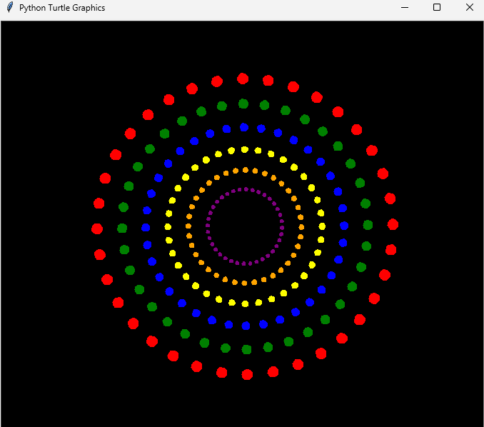

# Python-Colorful-Circles-Spiral-Using-Python-Turtle-Graphics
# 🌈 Colorful Circles Spiral - Python Turtle Project

This Python Turtle project generates a stunning spiral of colorful circles using nested loops, geometric motion, and custom color settings.

## Demo


## 🧰 Tools & Libraries
- Python 3.x
- `turtle` (standard graphics library)

## 🎨 Features
- Spiral pattern with rotational symmetry
- Vibrant custom colors
- Black background for contrast
- Clean and animated drawing

## 💻 How to Run

```bash
python colorful_circles.py
